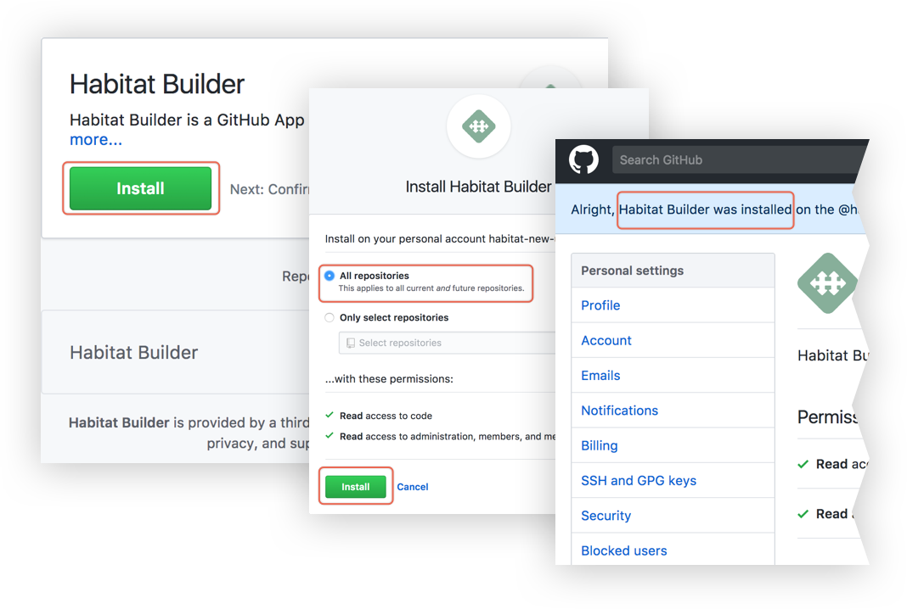
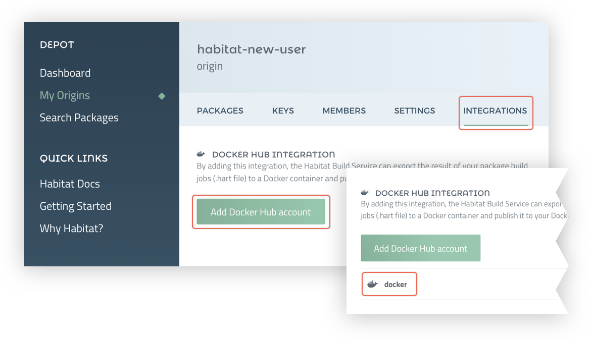
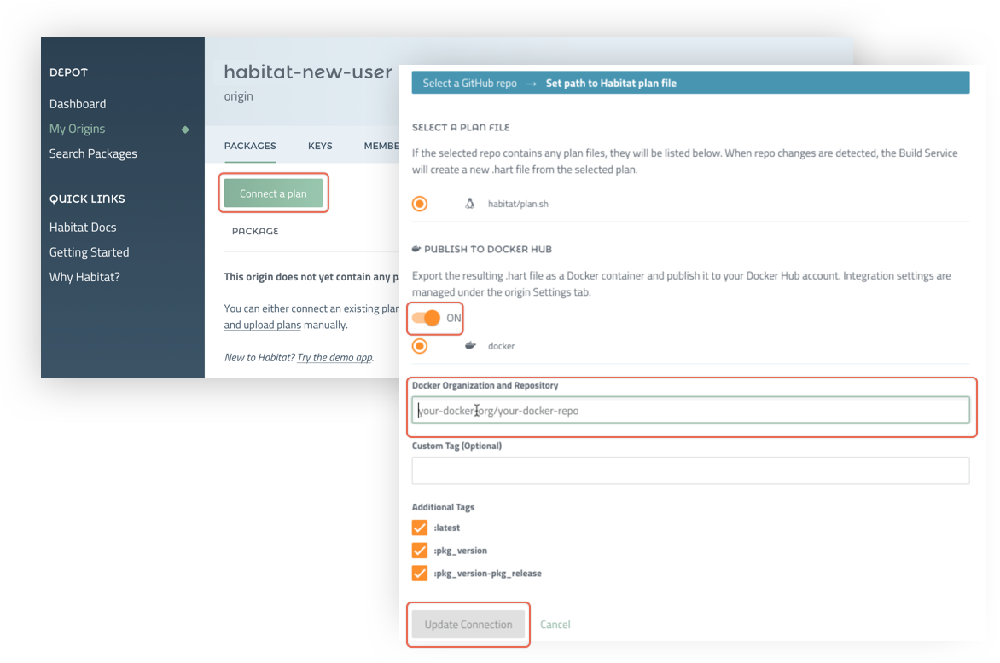
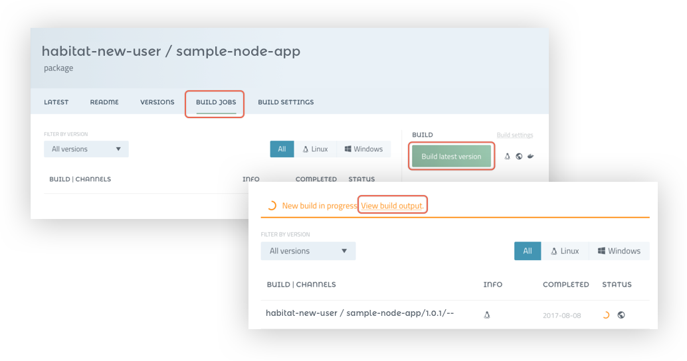

Greetings fellow Habicats!

One of the most useful features of Habitat is Scaffolding - these allow you to package your application with Habitat with very minimal code. They enable you to very rapidly (within minutes) package an application and export it to whatever format you need. Building an Habitat package with a Scaffolding is much easier than building a package without one.  One of the most popular Habitat Scaffolding is the NodeJS Scaffolding.

There will be much more coming to this Scaffolding in the coming months, but this post is meant to highlight what you can do with the NodeJS Scaffolding today and what you can expect in the near future.

Ready to get started?

## Pre-requisites
* A Github Account
* NodeJS installed on your workstation
* Habitat installed and set up on your workstation
* Text editor of your choice (in this post I use vim, but feel free to substitute your preferred editor)

## Creating your NodeJS application

Let's create an ultra-simple NodeJS application using [Express](https://expressjs.com/).

(This application is based on [this tutorial](https://developer.mozilla.org/en-US/docs/Learn/Server-side/Express_Nodejs/skeleton_website)).

```shell
$ express --git misfit_toys
$ cd misfit_toys
$ npm install
$ vim routes/index.js
```

Your routes/index.js file should look like this:

```js ~/misfit_toys/routes/index.js
var express = require('express');
var router = express.Router();

/* GET home page. */
router.get('/', function(req, res, next) {
  res.render('index', { title: 'Express' });
});

module.exports = router;
```

Change this line:

```js ~/misfit_toys/routes/index.js
res.render('index', { title: 'Express' });
```

To this:

```js ~/misfit_toys/routes/index.js
res.render('index', { title: 'Island of Misfit Toys' });
```

Now, your routes/index.js file should match the following:

```js ~/misfit_toys/routes/index.js
var express = require('express');
var router = express.Router();

/* GET home page. */
router.get('/', function(req, res, next) {
  res.render('index', { title: 'Island of Misfit Toys' });
});

module.exports = router;
```

If you'd like, start the app locally

```shell ~/misfit_toys
$ npm start
```

Then check out your running application at http://localhost:3000/

## Habitizing your NodeJS application

Now let's package up this application with Habitat.

In the same directory as your application (the misfit_toys directory), run this command:

```shell ~/misfit_toys
$ hab plan init -s node
```

This creates a habitat directory along with several starter files.  Open up habitat/plan.sh:

```bash ~/misfit_toys/habitat/plan.sh
pkg_name=misfit_toys
pkg_origin=your_origin
pkg_version="0.1.0"
pkg_Scaffolding="core/scaffolding-node"
```

Make sure that pkg_origin is set to your Habitat origin.  There are not other changes we need to make to package this with Habitat. Save and close the file.

Now, enter the Habitat studio to build the application.

```shell
$ hab studio enter
```

Once you are in the studio, build the application with the "build" command

```studio
$ build
```

This will build your package! You can find it in the results directory (both in and out of the studio). We could take this package and run it on a Virtual Machine or Bare Metal Server...but let's try something new. This particular application does not have any persistant data, which makes it ideal to run in a container. With just one command, we can export this package to a ready-to-run Docker image.

```studio
$ hab pkg export docker ./results/<your habitat package>.hart
```

Now exit out of the studio:

```studio
$ exit
```

And run the Docker image you just created:

```shell ~/misfit_toys
$ docker run -it -p 8000:8000 your_origin/misfit_toys
```

Then check it out in your browser by navigating to http://localhost:8000.

You can then upload this image to Amazon or Azure Container Services, Kubernetes, and more.

## Uploading to Builder

Let's now use the Habitat builder service to set up automatic builds and rebuilds of our application.

First, upload the code up to [Github](https://github.com/). For information about this, check out the [Creating a repository on Github guide](https://help.github.com/articles/creating-a-repository-on-github/).

Once it's up on Github, log into [Habitat Builder](https://bldr.habitat.sh/#/sign-in), and set up an origin if you have not done so already.

Navigate to the view page for this origin by clicking "My Origins", and then the link to the origin you want this package to be stored under.

### Connecting your Github repo to Builder

First, you will need to install the [Habitat Builder App](https://github.com/apps/habitat-builder) on your Github repo.



### Connecting to Docker Hub (optional)

If you like, you can connect Builder to a [Docker Hub](https://hub.docker.com/) account.



### Adding the Github repo to your origin

Now, make sure you are on the view page for your origin, then click on the "Connect a Plan" button. Fill in the text box with your github organization name/repo name.

Optionally, you can also connect to your Docker Hub account - builds of this package will automatically be exported as Docker images to your Docker Hub account.



### Running a build

Let's run our first build. From the "Build Jobs" tab click the big green "Build Latest Version" button and watch your build in action!



### Using the build

Once the build is complete, you can either download and install the package itself with

```shell ~/misfit_toys
$ hab install your_origin/package_name
```

Or, if you set up an integration with Docker Hub, you can now run your package as a docker container image with just two commands:

```shell ~/misfit_toys
$ docker pull your_docker_org/your_docker_repo
$ docker run -it -p 8000:8000 your-docker-org/your-docker-repo
```

Everytime you commit new code to your application's Github repository, Builder will automatically do a new build and (if you set it up) push an image of that build to Docker Hub! You can use that image with Kubernetes, Amazon or Azure Container Services, and more!

## What if I want to use a different version of NodeJS?

By default, the Node Scaffolding uses the most recent release of the [core/node](https://bldr.habitat.sh/#/pkgs/core/node/latest) package available on Builder.

If you'd like to use a different version of Node, you can! There are three ways to do this (the Node Scaffolding will still use the appropriate version of the core/node package).

* Specify it in your application's package.json, i.e.

```js ~/misfit_toys/package.json
"engines": {
  "node": ">=5.6.0",
},
```

You can use version numbers in these formats "5.0.0", "v5.0.0", "=5.0.0", ">=5.0.0", ">5.0.0", "<=5.0.0", "<5.0.0"

* Write an .nvmrc in your application's root directory
* Set the scaffolding_node_pkg variable in your Plan with a valid Habitat package identifier (i.e. your_origin/node/5.0.0)

What about if your application specifies different versions in different places? A Plan variable will take priority ov package.json and package.json will take priority over an .nvmrc file.


## Coming Soon

If this seems like a very simple example, it is. More functionality is on the way to allow you to use Scaffolding with more complex NodeJS applications - including both React and Angular.

* Running pre-build and post-build hooks - this is critical to supporting any non-trivial React or Angular applications
* Allowing a connection to a database - also critical for any database backed application.

These are in active development now, look for them soon!
