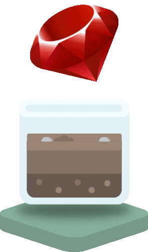

I made two attempts at learning Habitat over the past year. I watched all the available videos. Built and then rebuilt the sample applications in the tutorials. And when I was all done, I started to ask: _what do I do now?_

Kelsey Hightower’s [Keynote at ChefConf 2017](https://www.youtube.com/watch?v=-yTeXCY3iM0) inspired me. Particular his description on how he learns new things:

> “I take something that I know and pair it up with something that I don’t know.” ~ Kelsey Hightower

Watching him playfully demonstrate Habitat working with Kubernetes brought me back to another requirement for me to learn successfully: I need for my work to bring delight. His talk reminded me that learning is also play. This spurred me to create a [new screencast series](https://www.youtube.com/playlist?list=PL11cZfNdwNyOVVmBkCQJZgHRhURTGmEIZ) focused taking a Ruby application, built from scratch, and packaging it with Habitat. The resulting application lets you generated animated images from any source image, like this:

Within a few hours I had a working script generating images filled with a friend’s face. By late afternoon, the functioning web service was churning out animated images of all my co-workers. The next morning, with some help from the amazing [Habitat Community](http://slack.habitat.sh/) and [documentation](http://localhost:4567/docs), I had my web application successfully packaged with Habitat.

After a quick celebration, I went back to break down the application into a series of small exercises. I built the entire Ruby application and web service from scratch. Only interested in Habitat, skip ahead and focus on the exercises that:

* [Use Habitat’s scaffolding to package a web application](https://www.youtube.com/watch?v=z1EJx7ak-m0&list=PL11cZfNdwNyOVVmBkCQJZgHRhURTGmEIZ&index=4)
* [Upgrade and re-build an application dependency](https://www.youtube.com/watch?v=p8lWgEh5k8E&index=5&list=PL11cZfNdwNyOVVmBkCQJZgHRhURTGmEIZ)
* [Reconfigure Habitat services through re-packaging and live updates](https://www.youtube.com/watch?v=HFXpWMTvIDc&list=PL11cZfNdwNyOVVmBkCQJZgHRhURTGmEIZ&index=7)

Through this entire process I continue to learn more about Habitat. And if this resource helps make learning Habitat more approachable and delightful for you, then I feel my work has made an impact.

## More Learning Resources

Would you like to walk through a few more tutorials that will increase your Habitat skills in small exercises? Then try [Learn Chef Rally](https://learn.chef.io)'s:

* [Building Applications with Habitat](https://learn.chef.io/tracks/habitat-build) Track

> Combine a few basic ingredients and you’ll have the recipe for building modern and legacy applications that run anywhere. See how plans help you build software consistently and how the Supervisor starts, monitors, and acts upon changes made to your services.

* [Deploying Applications with Habitat](https://learn.chef.io/tracks/habitat-deploy) Track

> Ready to serve up your app to your users? Use Habitat Builder to neatly package your app and anything it needs to run. Deploy your app to the cloud or anywhere else and keep it updated in real time.
